# 中州养老管理系统 - 管理后台前端

中州养老管理系统（ZhongZhou Elderly Care）管理后台前端，基于 Vue 3 + Vite + Element Plus 构建，覆盖 11 大业务域共 24 个功能页面。

## 项目预览

### 登录

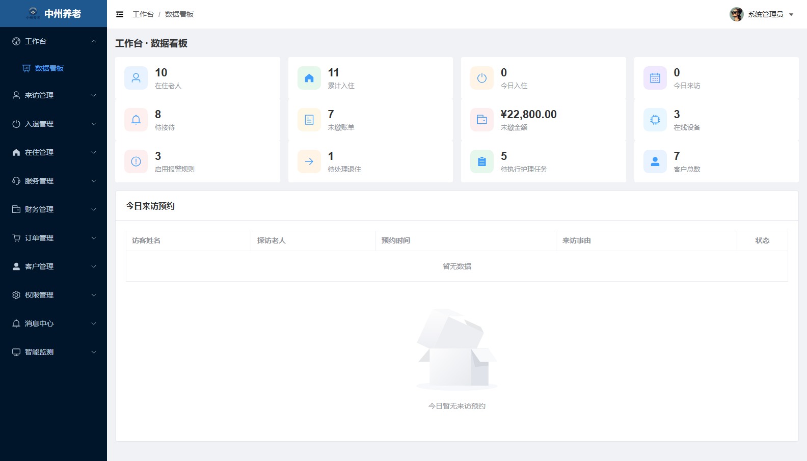

---

### 工作台

| 数据看板 |
| --- |
| 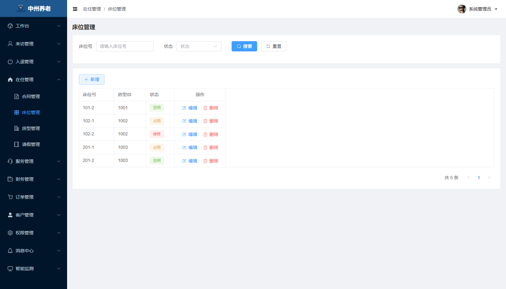 |

聚合在住老人、今日入住 / 来访、未缴账单、待执行护理任务、在线设备等 12 项核心运营指标，下方展示当日来访预约明细。

---

### 来访管理

| 预约登记 | 来访登记 |
| --- | --- |
| 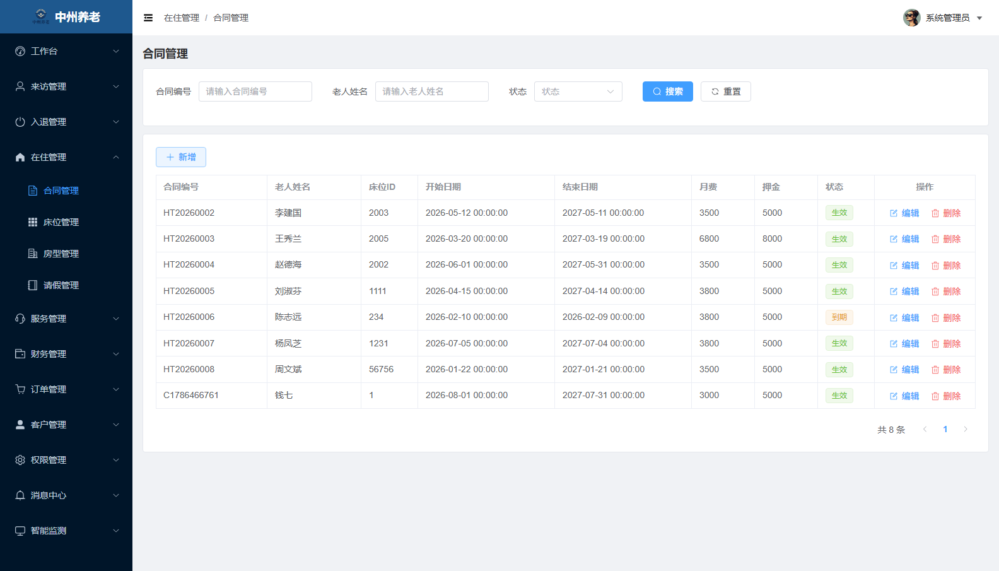 | 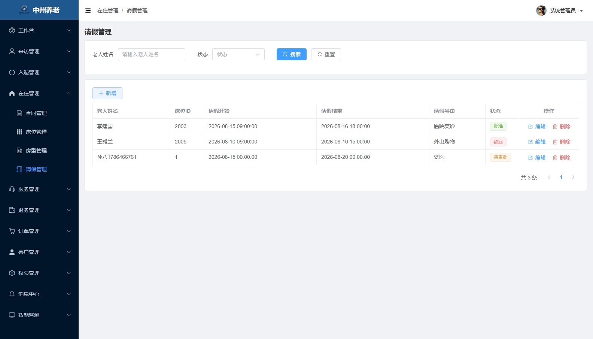 |

---

### 入退管理

| 入住管理 | 退住管理 |
| --- | --- |
| 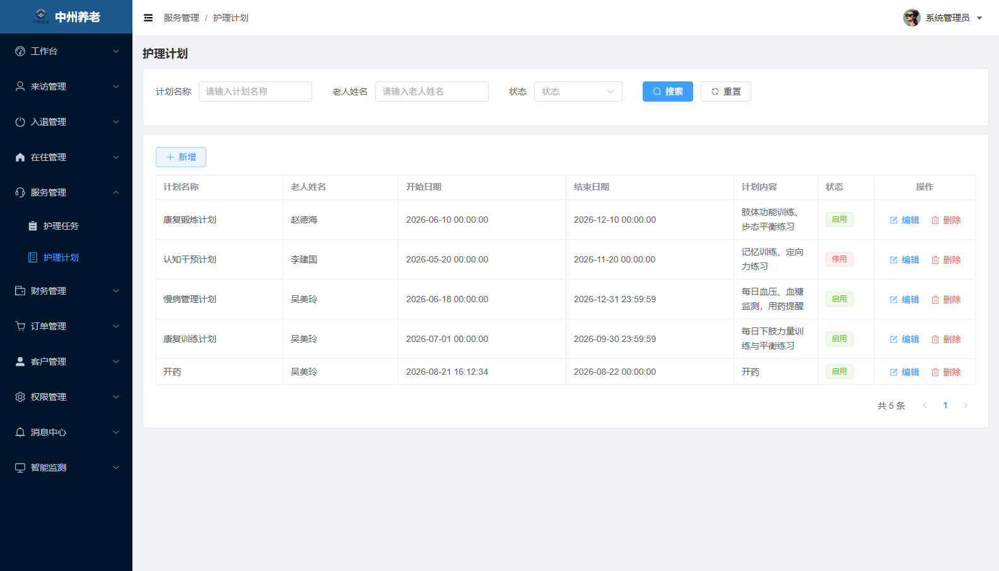 | 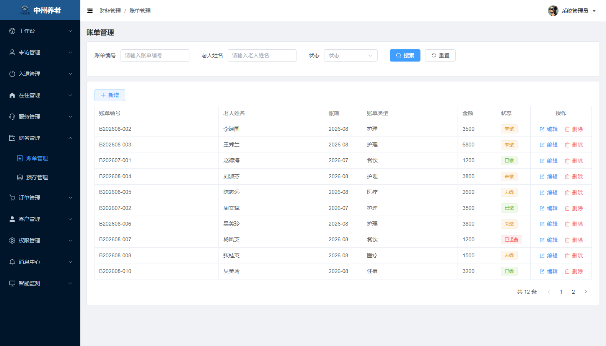 |

---

### 在住管理

| 房型管理 | 床位管理 |
| --- | --- |
| 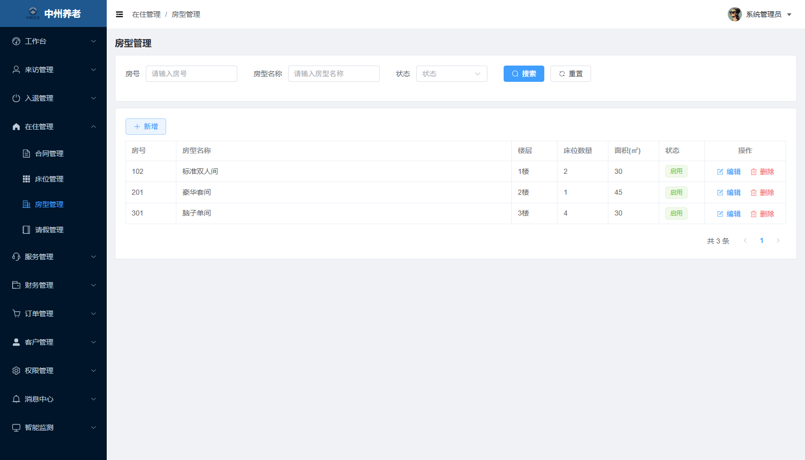 | 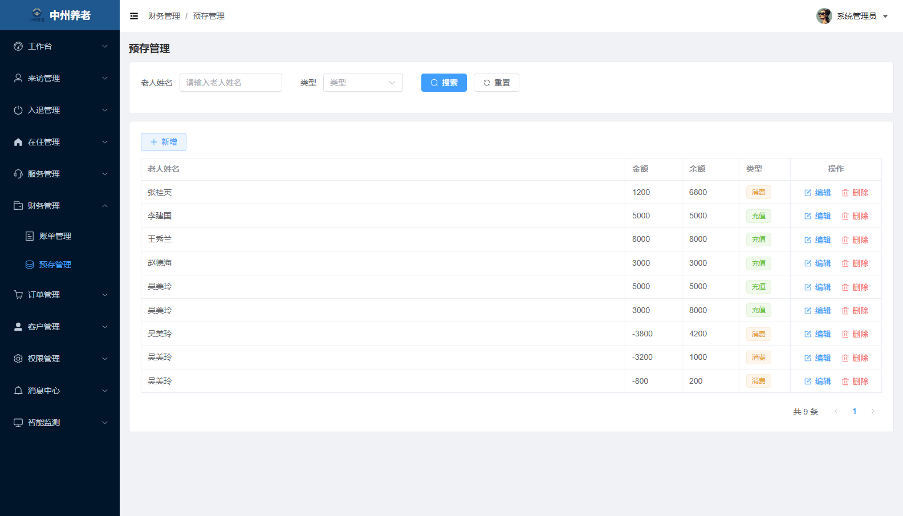 |

| 合同管理 | 请假管理 |
| --- | --- |
| 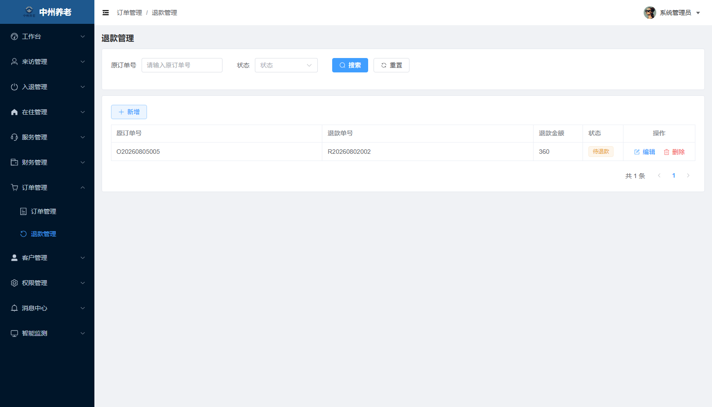 | 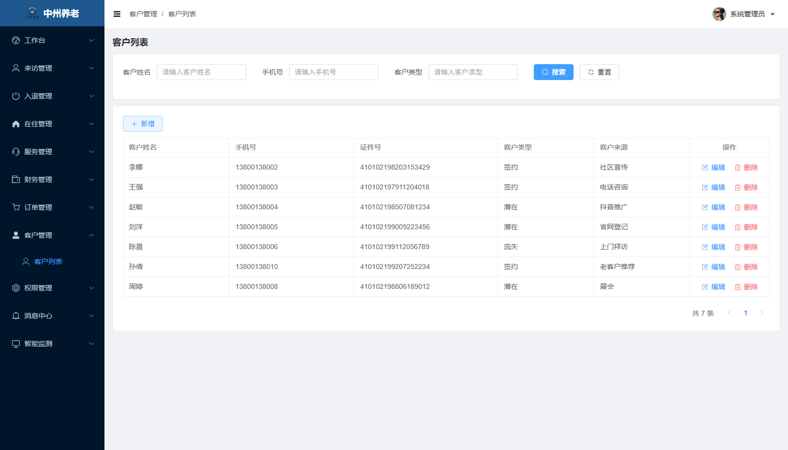 |

---

### 服务管理

| 护理任务 | 护理计划 |
| --- | --- |
|  | 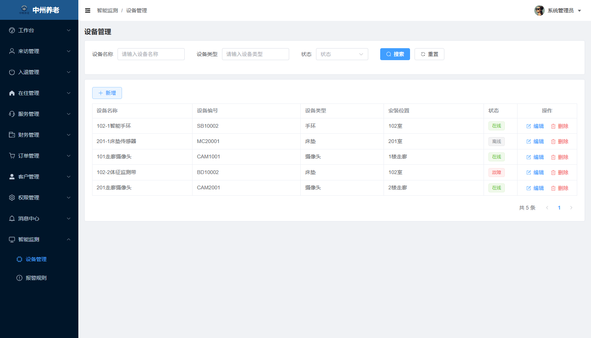 |

---

### 财务管理

| 账单管理 | 预存管理 |
| --- | --- |
| 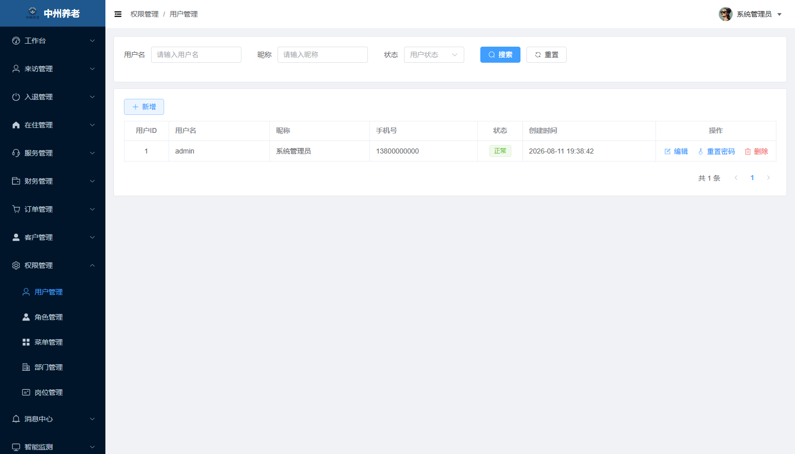 |  |

---

### 订单管理

| 订单管理 | 退款管理 |
| --- | --- |
|  |  |

---

### 客户管理

| 客户列表 |
| --- |
|  |

---

### 消息中心

| 消息推送 |
| --- |
| 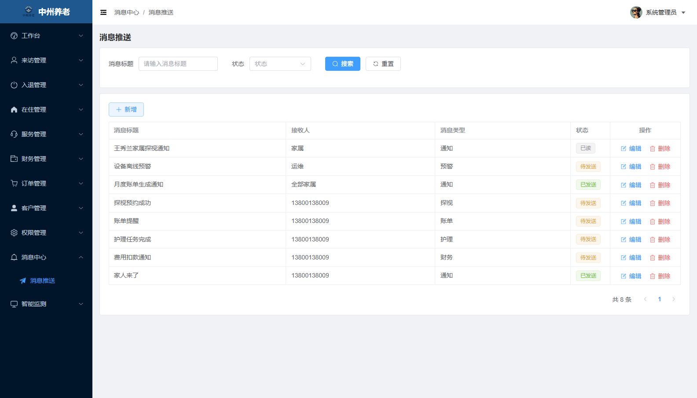 |

---

### 智能监测

| 设备管理 | 报警规则 |
| --- | --- |
|  | 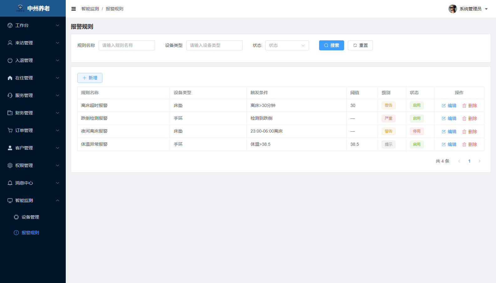 |

---

### 系统管理

| 用户管理 | 角色管理 |
| --- | --- |
|  | 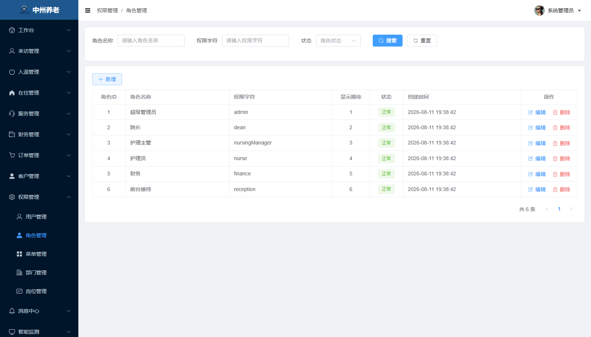 |

| 菜单管理 | 部门管理 |
| --- | --- |
| 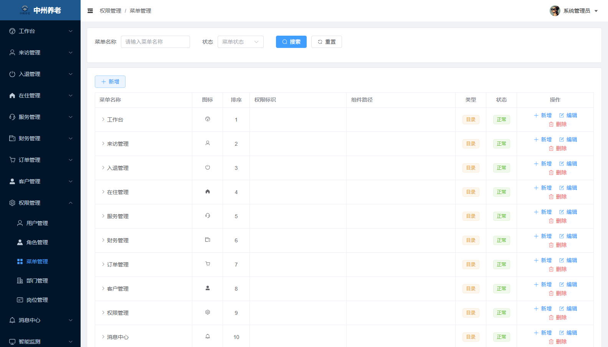 | 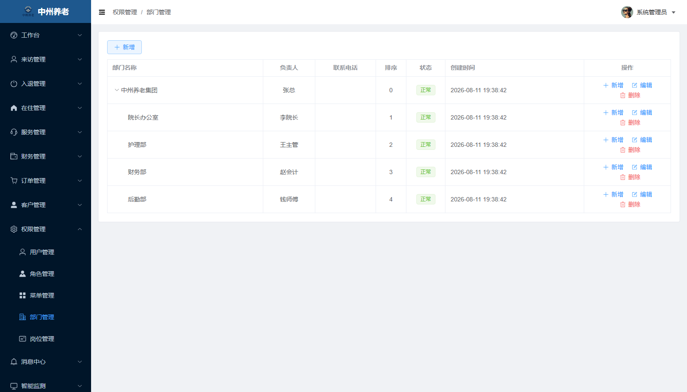 |

| 岗位管理 |
| --- |
| 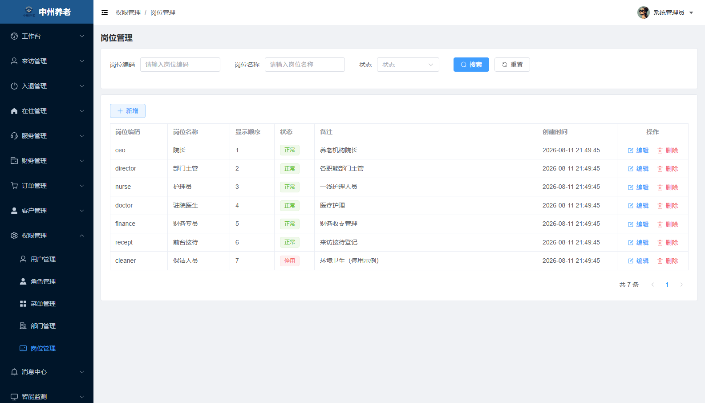 |

**用户管理**：支持用户与部门、角色的关联分配，提供重置密码等运维操作。
**角色管理**：基于 `el-tree` 实现树形菜单权限分配，提交时合并 `getCheckedKeys` 与 `getHalfCheckedKeys`，保证父子节点权限一致。
**菜单管理**：平铺数据经 O(n) 建树后以树形表格渲染，支持目录 / 菜单 / 按钮三种类型，菜单的 `component` 字段直接驱动前端动态路由。

## 技术栈

- **Vue 3** —— 渐进式 JavaScript 框架
- **Vite** —— 前端构建工具与开发服务器
- **Vue Router 4** —— 前端路由
- **Pinia** —— 状态管理
- **Element Plus** —— UI 组件库
- **Axios** —— HTTP 请求
- **js-cookie** —— Cookie 操作
- **NProgress** —— 路由加载进度条
- **Sass** —— CSS 预处理器

## 核心设计

### 配置驱动的通用 CRUD 引擎

24 个页面中有 19 个业务模块共用 `src/views/business/index.vue` 一个组件，页面结构完全由 `src/views/business/config.js` 中的声明式配置描述：

| 配置项 | 作用 |
| --- | --- |
| `moduleKey` | 后端 `@BizModule` 标识，拼装 `/biz/{module}/...` 接口 |
| `columns` | 表格列，`type: 'tag'` 时按 `dict` / `tagType` 映射状态标签 |
| `search` | 搜索字段，自动复用 `form` 中的控件类型 |
| `form` | 表单字段，`type` 支持 `select` / `datetime` / `number` / `textarea` |
| `required` | 自动生成表单校验规则 |

其余 5 个页面（工作台、用户、角色、菜单、部门）因交互复杂度较高而单独实现。新增一个业务模块只需添加一段配置，无需改动任何组件代码。

### 后端驱动的动态路由与权限

1. 登录后请求 `/auth/getRouters` 获取路由树（本环境返回 11 个顶级菜单、24 个页面）
2. `import.meta.glob('@/views/**/*.vue')` 批量注册视图组件
3. 递归转换后端路由结构，通过 `router.addRoute` 动态挂载
4. `next({ ...to, replace: true })` 重新进入守卫，解决刷新页面时动态路由尚未注册导致的白屏
5. 未开发页面自动降级到占位页，保证菜单始终可点击

### 统一的请求层

`src/utils/request.js` 封装 Axios，提供 Token 自动注入、响应统一拆包、错误分级处理、二进制流响应直通；通过标志位避免并发请求下登录态失效弹窗重复弹出。

## 业务模块

| 业务域 | 页面 |
| --- | --- |
| 工作台 | 数据看板 |
| 来访管理 | 预约登记、来访登记 |
| 入退管理 | 入住管理、退住管理 |
| 在住管理 | 房型管理、床位管理、合同管理、请假管理 |
| 服务管理 | 护理任务、护理计划 |
| 财务管理 | 账单管理、预存管理 |
| 订单管理 | 订单管理、退款管理 |
| 客户管理 | 客户列表 |
| 消息中心 | 消息推送 |
| 智能监测 | 设备管理、报警规则 |
| 系统管理 | 用户管理、角色管理、菜单管理、部门管理、岗位管理 |

## 环境要求

- Node.js >= 18
- 包管理器：npm（或 pnpm / yarn）

## 安装与运行

```bash
# 安装依赖
npm install

# 启动开发服务器
npm run dev

# 构建生产环境代码
npm run build

# 本地预览构建产物
npm run preview
```

## 环境变量

参考下表创建 `.env.development` 与 `.env.production`：

| 变量 | 说明 | 示例 |
| --- | --- | --- |
| `VITE_APP_BASE_API` | 接口前缀，同时作为 Vite 代理匹配路径 | `/dev-api` |
| `VITE_APP_TARGET` | 后端服务地址 | `http://localhost:9995` |

## 目录结构

```
zzyl-frontend-b/
├── docs/
│   └── screenshots/   # 全部 24 个页面的功能截图
├── src/
│   ├── api/           # 接口请求封装
│   ├── assets/        # 静态资源
│   ├── layout/        # 页面布局组件
│   ├── router/        # 路由配置
│   ├── store/         # Pinia 状态管理
│   ├── styles/        # 全局样式
│   ├── utils/         # 工具函数（request / auth）
│   ├── views/         # 页面视图组件
│   ├── App.vue        # 根组件
│   ├── main.js        # 入口文件
│   └── permission.js  # 路由权限拦截
├── index.html
├── package.json
└── vite.config.js
```

## 说明

- 路由权限拦截统一在 `src/permission.js` 中处理，接口请求统一在 `src/api` 中封装
- 配套后端服务：`zzyl-backend`（Spring Boot 3 + Java 17 + MyBatis-Plus）
- 配套家属端：`zzyl-frontend-c`（uni-app + Vue 3 微信小程序）
